# Linux Systems Administration Lab

## About this project

I recreated a Linux administration lab from my Rice University Cybersecurity Boot Camp to refresh what I learned and practice on my own Ubuntu VM.

I created users and groups, checked account-file permissions, assigned sudo access, and set up a shared folder. I tested access from different accounts so I could see whether the permissions worked. I also ran a Lynis audit and reviewed some of its findings.

This was a practice lab with fictional user accounts.

## Lab setup

| Item | Environment |
| --- | --- |
| Virtualization | UTM on my Mac |
| Operating system | Ubuntu 25.10, Questing Quokka |
| Architecture | ARM64 (`aarch64`) |
| Existing administrator | `steve` |
| New lab users | `sam`, `joe`, `amy`, `sara`, `admin1` |
| Shared group | `engineers` |
| Audit tool | Lynis 3.1.4 |
| Lab date | October 7, 2026 |

I checked the environment before making changes:

```bash
cat /etc/os-release
uname -m
id
sudo -l
```

These commands show the Ubuntu release, CPU architecture, current account and groups, and available sudo privileges.

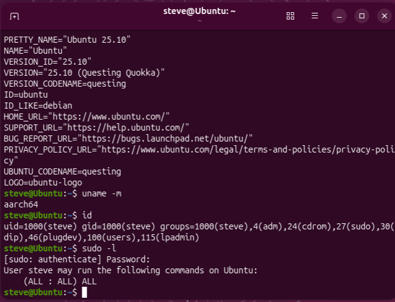

**Lab limitation:** Ubuntu 25.10 had reached end of life when I completed this lab. I used the existing VM for practice.

## 1. Check account-file permissions

I started by checking the permissions on the system account files:

```bash
ls -l /etc/shadow /etc/gshadow /etc/group /etc/passwd
```

| File | Owner and group | Permissions |
| --- | --- | --- |
| `/etc/passwd` | `root:root` | `644` (`-rw-r--r--`) |
| `/etc/group` | `root:root` | `644` (`-rw-r--r--`) |
| `/etc/shadow` | `root:shadow` | `640` (`-rw-r-----`) |
| `/etc/gshadow` | `root:shadow` | `640` (`-rw-r-----`) |

passwd and group contain account and group information that ordinary users can read. The shadow files contain protected password-related information and have more restricted access.

My original assignment asked for 600 on the shadow files. I kept Ubuntu's existing 640 permissions with the shadow group. I learned to check the operating system's defaults before changing important system files.

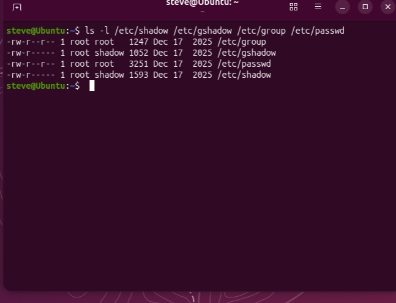

## 2. Create the lab accounts

I created five accounts with home directories, private groups, and Bash shells.

```bash
sudo useradd -m -U -s /bin/bash sam
sudo useradd -m -U -s /bin/bash joe
sudo useradd -m -U -s /bin/bash amy
sudo useradd -m -U -s /bin/bash sara
sudo useradd -m -U -s /bin/bash admin1
```

The options helped me understand what useradd was setting up.

- -m creates the user's home directory.
- -U creates a group with the same name as the user.
- -s /bin/bash sets the login shell to Bash.

I verified the accounts and home directories.

```bash
getent passwd sam joe amy sara admin1
ls -ld /home/sam /home/joe /home/amy /home/sara /home/admin1
```

Each account had the expected home directory and shell. The home directories belonged to their respective users and private groups, with permissions of 750.

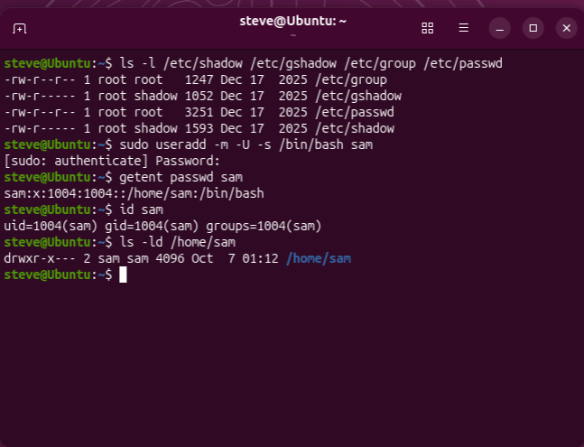

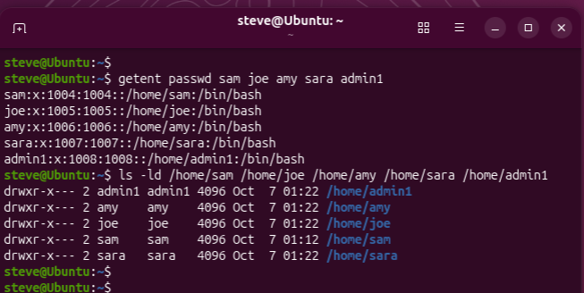

## 3. Assign and verify sudo access

I set a password for admin1 and added it to the sudo group.

```bash
sudo passwd admin1
sudo usermod -aG sudo admin1
id admin1
sudo -l -U admin1
```

In usermod, -G selects supplementary groups and -a appends membership while preserving existing groups. In sudo -l -U admin1, -l lists privileges and -U selects the account to check.

The output confirmed that admin1 had full sudo access. The existing steve account also retained its administrator access.

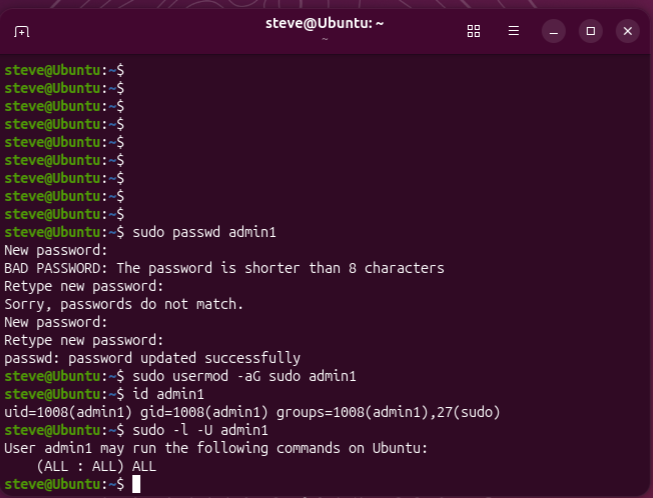

I checked the four standard lab users separately.

```bash
sudo -l -U sam
sudo -l -U joe
sudo -l -U amy
sudo -l -U sara
```

All four returned a message saying they were not allowed to run sudo. This was the result I wanted. Only admin1 had sudo access among the five new accounts.

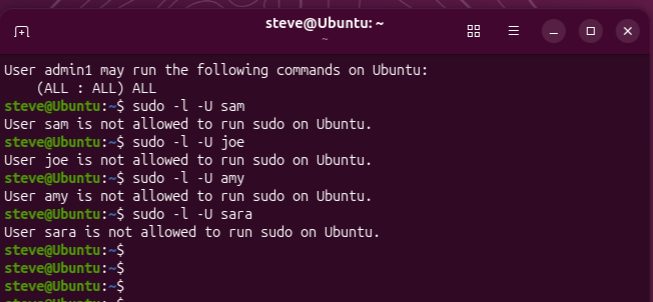

## 4. Create a shared group and folder

I created the engineers group and added the four standard users.

```bash
sudo groupadd engineers
sudo usermod -aG engineers sam
sudo usermod -aG engineers joe
sudo usermod -aG engineers amy
sudo usermod -aG engineers sara
getent group engineers
```

I also ran id for each user to verify membership. The group contained sam, joe, amy, and sara.

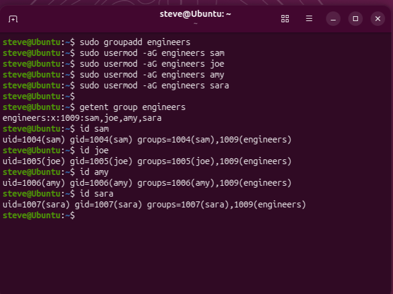

Then I created the shared folder.

```bash
sudo mkdir /home/engineers
sudo chown root:engineers /home/engineers
sudo chmod 2770 /home/engineers
ls -ld /home/engineers
```

chown sets the owner and group. The 2770 permissions give the owner and group permission to list, modify, and enter the directory. Other users have no access. The leading 2 sets the setgid bit, which makes new files inherit the directory's group.

The result was drwxrws---, owned by root:engineers. I used this instead of the original lab's 777 permissions so the folder would be restricted to the intended group.

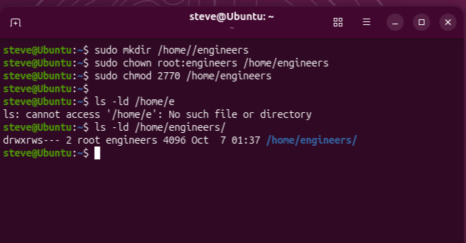

## 5. Test allowed and denied access

### Sam creates a file

From my administrator account, I opened a login shell as Sam.

```bash
sudo -iu sam
whoami
umask 0007
echo "Created by Sam" > /home/engineers/team-notes.txt
ls -l /home/engineers/team-notes.txt
cat /home/engineers/team-notes.txt
exit
```

sudo -iu sam switches to Sam's login shell. After that, the file commands run as Sam. whoami confirmed the identity.

The session's umask 0007 allowed a normal new text file to have permissions of 660. The owner and group could read and write, others had no access. This umask applied to that shell session. I did not configure a permanent default or a default ACL.

The file belonged to sam:engineers. This also verified that the folder's setgid setting worked. Setgid controls group inheritance. The umask helped give the new file group write permission.

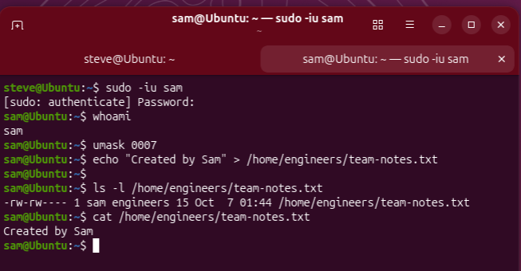

### Joe edits Sam's file

Back as Steve, I switched to Joe and tested the same file.

```bash
sudo -iu joe
whoami
cat /home/engineers/team-notes.txt
echo "Updated by Joe" >> /home/engineers/team-notes.txt
cat /home/engineers/team-notes.txt
ls -l /home/engineers/team-notes.txt
exit
```

`>>` appends text to the file. Joe successfully read and updated it, and ownership remained sam:engineers.

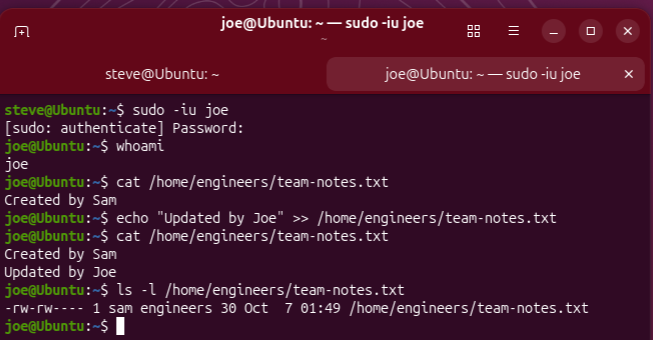

### Admin1 is denied ordinary access

I tested admin1, which was outside the engineers group.

```bash
sudo -iu admin1
whoami
id
ls /home/engineers
cat /home/engineers/team-notes.txt
touch /home/engineers/admin1-test.txt
exit
```

Listing the folder, reading the file, and creating a file all returned **Permission denied**. These commands used admin1's ordinary account permissions. Admin1 could still use its sudo privileges to gain root access.

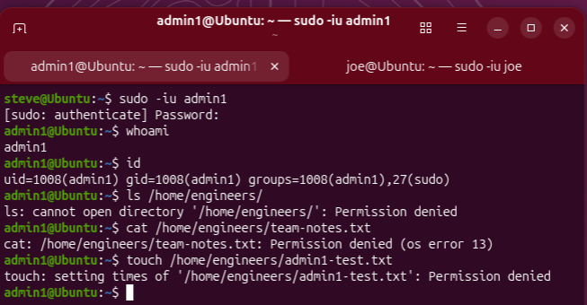

The four standard accounts did not have passwords assigned during this lab. I used my existing administrator account to open their test shells.

## 6. Run a Lynis audit

I installed Lynis, verified the package, and ran an audit:

```bash
sudo apt install lynis
lynis --version
dpkg -s lynis
sudo lynis audit system --quick
```

The version was 3.1.4, and the package status was **install ok installed**. The --quick option skips pauses between sections while still running the audit checks.

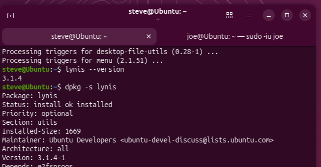

| Audit result | Value |
| --- | --- |
| Hardening index | 63 |
| Tests performed | 274 |
| Warning entries | 2 |
| Detailed log | `/var/log/lynis.log` |
| Report | `/var/log/lynis-report.dat` |

The hardening index is a Lynis indicator of system hardening. It is not a percentage of tests passed or proof that the system is secure.

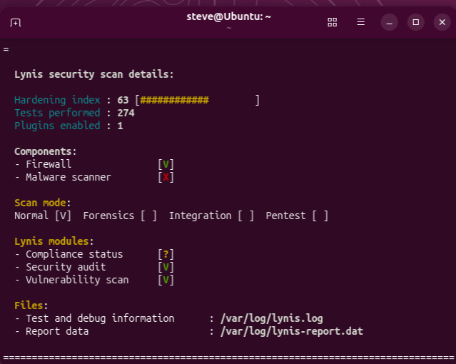

I selected the findings from the report with grep.

```bash
sudo grep -E '^(warning|suggestion)\[\]=' /var/log/lynis-report.dat
sudo grep '^warning\[\]=' /var/log/lynis-report.dat
```

The first command displays warnings and suggestions. The second displays only warnings.

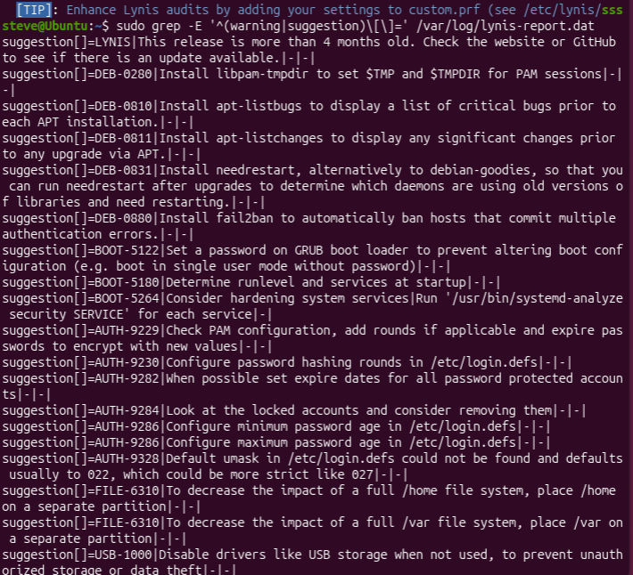

### Findings and possible follow-up

| Finding | What I would check next |
| --- | --- |
| `PKGS-7388`: Lynis could not find a security repository in the APT sources | Review the configured repositories and move the VM to a supported Ubuntu release. |
| `PKGS-7392`: Lynis reported one or more vulnerable packages | Review the detailed log to identify the packages and available fixes. The warning output did not name them. |
| Password age and expiration suggestions | Learn how the settings work and choose a policy based on the accounts' purpose. |
| Locked-account suggestion | Review why accounts are locked. My standard lab accounts did not have passwords assigned, so I would not remove them just because they are locked. |
| Default umask suggestion | Review the system default separately from the temporary `0007` used for Sam's shared-file test. |
| Service hardening suggestion | Review the services that are needed and their settings before changing them. |

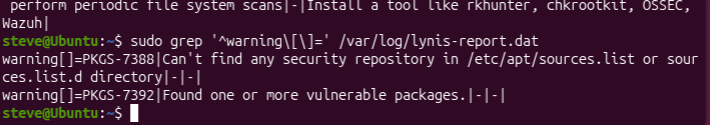

I documented these findings but did not apply the suggested hardening changes or fix the package warnings. Each suggested change still needs to be checked against the system's purpose.

## What I learned

This lab helped me refresh the commands for managing local users, groups, and permissions. Testing as different accounts made the permissions easier to understand than just looking at the numbers.

I learned that a shared folder needs both the right group ownership and suitable permissions on the files inside it. I also practiced checking that access was denied when it should be.

Running Lynis gave me practice reading an audit report and separating completed work from recommendations that still need follow-up.

## References

- [Ubuntu user management](https://ubuntu.com/server/docs/how-to/security/user-management/)
- [Debian reference: authentication and account-file permissions](https://www.debian.org/doc/manuals/debian-reference/ch04.en.html)
- [Lynis getting started guide](https://cisofy.com/documentation/lynis/get-started/)
- [Ubuntu 25.10 end-of-life announcement](https://lists.ubuntu.com/archives/ubuntu-announce/2026-July/000325.html)
